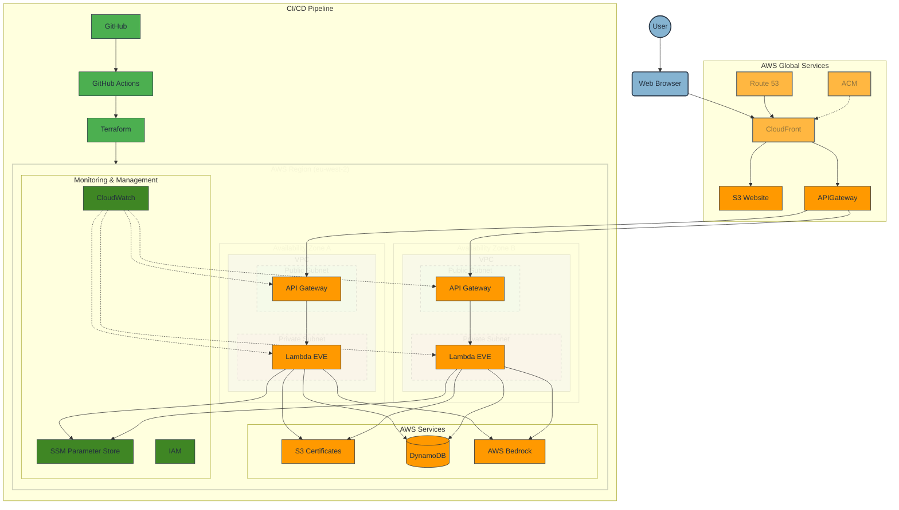

# CloudForgeX Architecture Diagram (Mermaid)

The architecture diagram illustrates the serverless design of CloudForgeX using AWS Architecture Icons. The system is organized into logical layers:

- **User Layer**: End users accessing the portfolio website through web browsers
- **AWS Global**: CloudFront, Route 53, and ACM for global content delivery and security
- **AWS Region (eu-west-2)**: Regional services organized by availability zones and VPC structure
  - **VPC with Public/Private Subnets**: API Gateway in public subnets, Lambda functions in private subnets
  - **AWS Services**: S3 for static website and certificates, DynamoDB for data storage, Bedrock for AI capabilities
  - **Monitoring & Management**: CloudWatch, SSM Parameter Store, and IAM for security and monitoring
- **CI/CD Pipeline**: GitHub, GitHub Actions, and Terraform for infrastructure deployment

The diagram shows the key data flows through the system, including user requests, API calls, and the deployment pipeline.