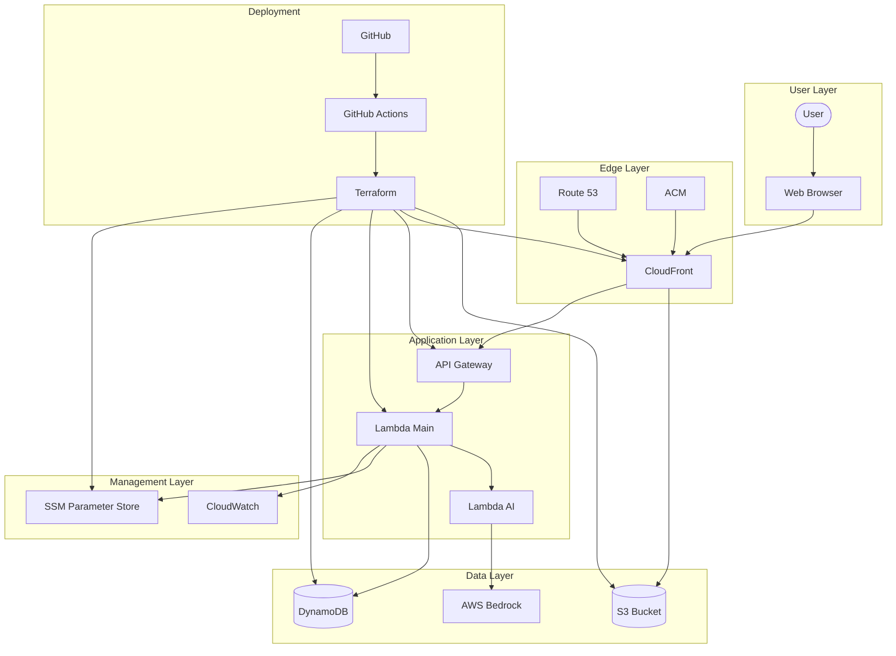

# CloudForgeX Architecture Documentation

## Table of Contents

- [System Overview](#system-overview)
- [Architecture Diagram](#architecture-diagram)
- [Component Breakdown](#component-breakdown)
- [Data Flow](#data-flow)
- [Security Architecture](#security-architecture)
- [Scalability and Performance](#scalability-and-performance)
- [Reliability and Fault Tolerance](#reliability-and-fault-tolerance)
- [AWS Services Utilised](#aws-services-utilised)
- [Infrastructure as Code Implementation](#infrastructure-as-code-implementation)
- [Monitoring and Observability](#monitoring-and-observability)
- [Networking Architecture](#networking-architecture)
- [CI/CD Pipeline Architecture](#cicd-pipeline-architecture)
- [Cost Optimisation](#cost-optimisation)
- [Key Design Decisions and Trade-offs](#key-design-decisions-and-trade-offs)
- [Future Enhancements](#future-enhancements)
- [References and Resources](#references-and-resources)

## System Overview

CloudForgeX is a serverless AI-powered portfolio hosted on AWS, showcasing cloud engineering expertise through a modern web application with an intelligent AI assistant named EVE. The system follows a serverless architecture pattern, leveraging AWS services for scalability, security, and cost efficiency. The architecture adheres to AWS Well-Architected Framework principles, emphasising operational excellence, security, reliability, performance efficiency, and cost optimisation.

## Architecture Diagram

The architecture diagram illustrates the serverless design of CloudForgeX, showing the interaction between frontend components hosted on S3/CloudFront and backend services powered by AWS Lambda and API Gateway. The diagram highlights security boundaries, data flow paths, and integration points between services. The layered approach demonstrates the separation of concerns and security boundaries between different components of the system.

## Component Breakdown

### Frontend

- **Static Website**: HTML5, CSS3, JavaScript (ES6+) hosted on S3
- **Content Delivery**: CloudFront distribution with global edge locations
- **Domain Management**: Route 53 with custom domain configuration
- **Security**: ACM for SSL/TLS certificates

### Backend

- **AI Assistant (EVE)**: AWS Lambda functions with AWS Bedrock (Claude Instant)
- **API Layer**: API Gateway for secure communication
- **Data Storage**: DynamoDB for context storage
- **Configuration**: SSM Parameter Store for secure configuration management

### Infrastructure as Code

- **Terraform Modules**: Modular approach for reusable components
- **CI/CD**: GitHub Actions for automated deployment

## Data Flow

1. User accesses the website via CloudFront distribution
2. Static content is served from S3 bucket
3. User interacts with EVE AI Assistant
4. Frontend sends requests to API Gateway
5. API Gateway triggers Lambda function
6. Lambda retrieves parameters from SSM Parameter Store
7. Lambda communicates with AWS Bedrock for AI responses
8. Response is returned to the user via API Gateway
9. Certificate viewing uses presigned S3 URLs for secure access

## Security Architecture

The security architecture implements defence-in-depth strategies across all layers:

- **Transport Security**: SSL/TLS encryption via ACM
- **API Security**: API Gateway with proper authentication
- **Configuration Security**: SSM Parameter Store for sensitive values
- **S3 Security**: Proper bucket policies and CORS configuration
- **Access Control**: IAM roles with least privilege principle
- **Content Security**: CSP implementation to prevent XSS attacks

The system follows AWS security best practices including:

- Encryption at rest for all data stores
- Encryption in transit for all communications
- Least privilege access control
- Regular security audits and compliance checks
- Secure API authentication and authorisation

## Scalability and Performance

The architecture is designed for high performance and automatic scaling:

- **CloudFront Caching**: Edge locations for reduced latency
- **Serverless Architecture**: Auto-scaling Lambda functions
- **DynamoDB**: On-demand capacity for variable workloads
- **Optimised Assets**: Efficient loading and rendering
- **Lazy Loading**: Improved performance for media assets

Performance considerations include:

- Content delivery optimisation through CloudFront
- Efficient database access patterns
- Optimised Lambda function performance
- Frontend performance optimisation techniques

## Reliability and Fault Tolerance

The system is designed for high availability and fault tolerance:

- **Multi-AZ Deployment**: High availability across availability zones
- **CloudFront Redundancy**: Global edge location network
- **S3 Durability**: 99.999999999% object durability
- **Error Handling**: Comprehensive error management in frontend and backend

Fault tolerance mechanisms include:

- Automatic failover between availability zones
- Graceful degradation of services
- Comprehensive error handling and recovery procedures
- Stateless application design for resilience

## AWS Services Utilised

The architecture leverages the following AWS services:

- **S3**: Static website hosting
- **CloudFront**: Content delivery network
- **Route 53**: DNS management
- **ACM**: SSL/TLS certificate management
- **Lambda**: Serverless compute
- **API Gateway**: API management
- **DynamoDB**: NoSQL database
- **Bedrock**: AI service for EVE assistant
- **SSM Parameter Store**: Secure configuration management

Each service is configured according to AWS best practices and optimised for the specific requirements of the CloudForgeX application.

## Infrastructure as Code Implementation

The infrastructure is fully defined and managed as code:

- **Terraform Modules**:
  - S3 and CloudFront for static hosting
  - Lambda and API Gateway for backend
  - DynamoDB for data storage
  - SSM for configuration management
  - IAM for access control
- **State Management**: Remote state with S3 backend
- **Variable Management**: Terraform variables for environment-specific values

The IaC implementation follows these principles:

- Modular design for reusability
- Version-controlled infrastructure
- Automated deployment through CI/CD
- Consistent environments across stages
- Infrastructure testing and validation

## Monitoring and Observability

The monitoring strategy provides comprehensive visibility into system health:

- **CloudWatch**: Metrics, logs, and alarms
- **X-Ray**: Distributed tracing (planned)
- **Error Tracking**: Client and server-side error logging

Observability features include:

- Real-time monitoring of application performance
- Automated alerting for critical issues
- Centralised logging for troubleshooting
- Performance metrics collection and analysis
- Custom dashboards for system health visualisation

## Networking Architecture

The networking architecture is designed for security and performance:

- **CloudFront Distribution**: Global edge network
- **API Gateway**: Regional endpoint
- **VPC Configuration**: Lambda functions in VPC (for enhanced security)

Network security measures include:

- Traffic encryption
- API request throttling
- DDoS protection via CloudFront
- Network access controls
- API Gateway resource policies

## CI/CD Pipeline Architecture

The CI/CD pipeline ensures reliable and consistent deployments:

- **GitHub Actions**: Automated deployment workflow
- **Testing**: Automated tests before deployment
- **Infrastructure Validation**: Terraform plan validation
- **Deployment Strategy**: Blue/green deployment for zero downtime

The pipeline implements:

- Automated testing at multiple levels
- Infrastructure validation before deployment
- Secure handling of deployment credentials
- Rollback capabilities for failed deployments
- Deployment notifications and reporting

## Cost Optimisation

The architecture implements several cost optimisation strategies:

- **Serverless Architecture**: Pay-per-use model
- **CloudFront Optimisation**: Efficient caching policies
- **S3 Storage Classes**: Appropriate storage class selection
- **Reserved Capacity**: For predictable workloads (where applicable)
- **Resource Tagging**: For cost allocation and tracking

Cost management practices include:

- Regular cost analysis and optimisation
- Automated resource cleanup
- Right-sizing of provisioned resources
- Cost allocation tagging strategy
- Budget alerts and monitoring

## Key Design Decisions and Trade-offs

### Serverless Architecture

**Decision**: Implement a fully serverless architecture using Lambda, API Gateway, and S3.
**Rationale**: Provides automatic scaling, reduced operational overhead, and pay-per-use cost model.
**Trade-offs**: Accepts cold start latency for infrequently used functions in exchange for cost efficiency and simplified operations.
**Alternatives Considered**: Traditional EC2-based architecture was evaluated but rejected due to higher operational complexity and fixed costs.

### AWS Bedrock with Claude Instant

**Decision**: Use AWS Bedrock with Claude Instant for the AI assistant capabilities.
**Rationale**: Provides advanced natural language processing capabilities with AWS integration and security.
**Trade-offs**: Higher cost compared to simpler rule-based systems, but delivers superior user experience and capabilities.
**Alternatives Considered**: Custom-trained models and third-party AI services were evaluated but rejected due to integration complexity and data security concerns.

### SSM Parameter Store

**Decision**: Implement SSM Parameter Store for configuration management.
**Rationale**: Provides secure, scalable parameter storage with versioning and encryption.
**Trade-offs**: Adds slight complexity compared to environment variables but significantly improves security posture.
**Alternatives Considered**: Environment variables and DynamoDB were evaluated but rejected due to security limitations and operational complexity.

### Terraform Modules

**Decision**: Adopt modular Terraform approach for infrastructure definition.
**Rationale**: Enhances reusability, maintainability, and consistency across environments.
**Trade-offs**: Requires initial investment in module design but pays dividends in long-term maintenance and scalability.
**Alternatives Considered**: CloudFormation and AWS CDK were evaluated but rejected due to team expertise and cross-cloud potential.

### Mobile-First Design

**Decision**: Implement mobile-first responsive design.
**Rationale**: Ensures optimal user experience across all devices, particularly important for portfolio accessibility.
**Trade-offs**: Requires additional design and testing effort but delivers superior user experience.
**Alternatives Considered**: Separate mobile site was evaluated but rejected due to maintenance overhead and SEO implications.

## Future Enhancements

Planned future enhancements to the architecture include:

1. **Enhanced Monitoring**: Implementation of X-Ray for distributed tracing
2. **Multi-Region Deployment**: Expansion to multiple AWS regions for global redundancy
3. **Advanced AI Capabilities**: Integration with additional AWS AI services
4. **Performance Optimisation**: Further optimisation of Lambda functions and frontend assets
5. **Expanded Security Controls**: Implementation of WAF and additional security layers

## References and Resources

- [AWS Well-Architected Framework](https://aws.amazon.com/architecture/well-architected/)
- [AWS Serverless Architecture Best Practices](https://docs.aws.amazon.com/lambda/latest/dg/best-practices.html)
- [Terraform Best Practices](https://www.terraform-best-practices.com/)
- [AWS Security Best Practices](https://aws.amazon.com/architecture/security-identity-compliance/)
- [CloudFront Developer Guide](https://docs.aws.amazon.com/AmazonCloudFront/latest/DeveloperGuide/Introduction.html)
- [Project README](https://github.com/JThomas404/cloudforgex/blob/main/README.md)
- [Frontend Implementation](https://github.com/JThomas404/cloudforgex/blob/main/frontend/)
- [Lambda Functions](https://github.com/JThomas404/cloudforgex/blob/main/lambda/)
- [Terraform Configuration](https://github.com/JThomas404/cloudforgex/blob/main/terraform/)

---
