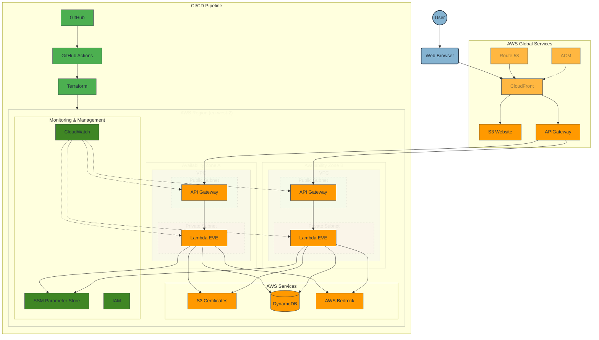
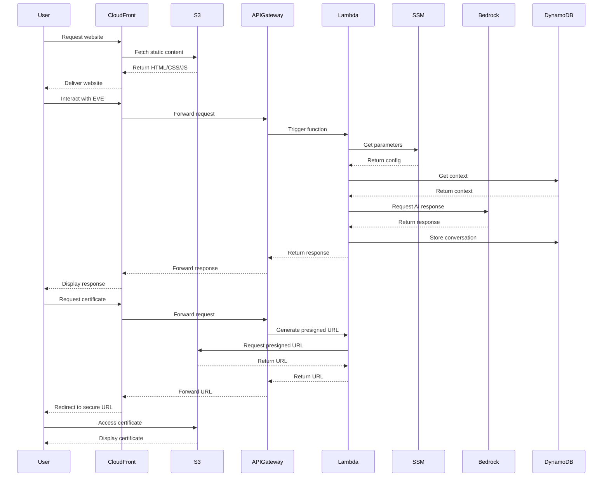
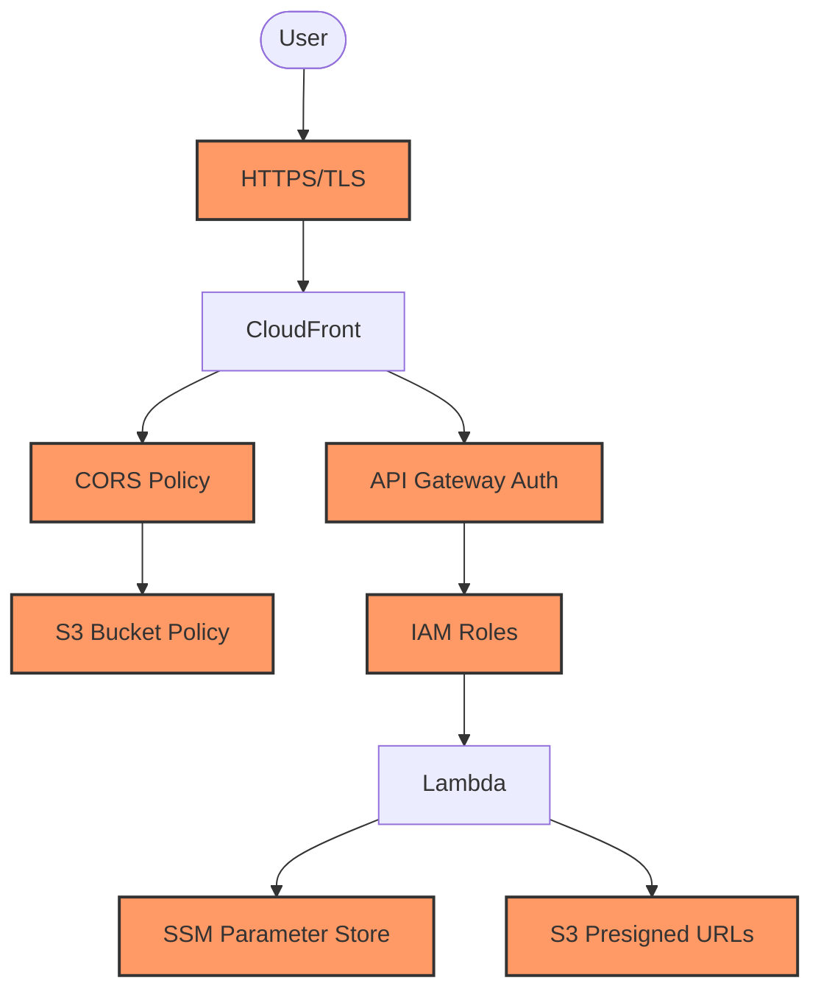

# CloudForgeX Architecture Documentation

## Table of Contents

- [System Overview](#system-overview)
- [Architecture Diagram](#architecture-diagram)
- [Component Breakdown](#component-breakdown)
- [Data Flow](#data-flow)
- [Security Architecture](#security-architecture)
- [Scalability and Performance](#scalability-and-performance)
- [Reliability and Fault Tolerance](#reliability-and-fault-tolerance)
- [AWS Services Utilised](#aws-services-utilised)
- [Infrastructure as Code Implementation](#infrastructure-as-code-implementation)
- [Monitoring and Observability](#monitoring-and-observability)
- [Networking Architecture](#networking-architecture)
- [CI/CD Pipeline Architecture](#cicd-pipeline-architecture)
- [Cost Optimisation](#cost-optimisation)
- [Key Design Decisions and Trade-offs](#key-design-decisions-and-trade-offs)
- [Future Enhancements](#future-enhancements)
- [References and Resources](#references-and-resources)

## System Overview

CloudForgeX is a serverless AI-powered portfolio hosted on AWS, showcasing cloud engineering expertise through a modern web application with an intelligent AI assistant named EVE. The system follows a serverless architecture pattern, leveraging AWS services for scalability, security, and cost efficiency. The architecture adheres to AWS Well-Architected Framework principles, emphasising operational excellence, security, reliability, performance efficiency, and cost optimisation.

This document details the architecture of CloudForgeX, a serverless AI-powered portfolio platform hosted on AWS. The system leverages modern cloud technologies to deliver a scalable, secure, and cost-effective solution featuring an intelligent AI assistant named EVE. The architecture follows AWS Well-Architected Framework principles and employs infrastructure as code practices using Terraform.

---

## Architecture Diagram



The architecture diagram illustrates the serverless design of CloudForgeX using AWS Architecture Icons. The system is organized into logical layers:

- **User Layer**: End users accessing the portfolio website through web browsers
- **AWS Global**: CloudFront, Route 53, and ACM for global content delivery and security
- **AWS Region (eu-west-2)**: Regional services organized by availability zones and VPC structure
  - **VPC with Public/Private Subnets**: API Gateway in public subnets, Lambda functions in private subnets
  - **AWS Services**: S3 for static website and certificates, DynamoDB for data storage, Bedrock for AI capabilities
  - **Monitoring & Management**: CloudWatch, SSM Parameter Store, and IAM for security and monitoring
- **CI/CD Pipeline**: GitHub, GitHub Actions, and Terraform for infrastructure deployment

The diagram shows the key data flows through the system, including user requests, API calls, and the deployment pipeline.

---

## Component Breakdown

### Frontend

- **Static Website**: HTML5, CSS3, JavaScript (ES6+) hosted on S3
- **Content Delivery**: CloudFront distribution with global edge locations
- **Domain Management**: Route 53 with custom domain configuration
- **Security**: ACM for SSL/TLS certificates

### Backend

- **AI Assistant (EVE)**: AWS Lambda functions with AWS Bedrock (Claude Instant)
- **API Layer**: API Gateway for secure communication
- **Data Storage**: DynamoDB for context storage
- **Configuration**: SSM Parameter Store for secure configuration management

### Infrastructure as Code

- **Terraform Modules**: Modular approach for reusable components
- **CI/CD**: GitHub Actions for automated deployment

## Data Flow



### Key Data Flows

1. **Website Access Flow**

   - User accesses the website via CloudFront distribution
   - Static content is served from S3 bucket

2. **EVE AI Assistant Interaction Flow**

   - User interacts with EVE AI Assistant in the browser
   - Frontend sends requests to API Gateway
   - API Gateway triggers Lambda function
   - Lambda retrieves parameters from SSM Parameter Store
   - Lambda retrieves conversation context from DynamoDB
   - Lambda communicates with AWS Bedrock for AI responses
   - Response is stored in DynamoDB and returned to the user

3. **Certificate Viewing Flow**
   - User requests to view certificates
   - Lambda generates presigned S3 URLs for secure access
   - User accesses certificates directly from S3 using temporary credentials

---

## Security Architecture



The security architecture implements defence-in-depth strategies across all layers:

| Layer             | Security Mechanism       | Implementation                                  |
| ----------------- | ------------------------ | ----------------------------------------------- |
| **Transport**     | SSL/TLS encryption       | ACM-managed certificates with automatic renewal |
| **API**           | Request authentication   | API Gateway with API key validation             |
| **Configuration** | Secure parameter storage | SSM Parameter Store with KMS encryption         |
| **Storage**       | Access control           | S3 bucket policies and CORS configuration       |
| **Compute**       | Least privilege          | IAM roles with specific permissions             |
| **Frontend**      | XSS prevention           | Content Security Policy implementation          |

The system follows AWS security best practices including:

- Encryption at rest for all data stores
- Encryption in transit for all communications
- Least privilege access control
- Regular security audits and compliance checks
- Secure API authentication and authorisation

> **Security Note**: All sensitive configuration values are stored in SSM Parameter Store and accessed by Lambda functions using IAM roles with specific permissions.

---

## Scalability and Performance

The architecture is designed for high performance and automatic scaling:

- **CloudFront Caching**: Edge locations for reduced latency
- **Serverless Architecture**: Auto-scaling Lambda functions
- **DynamoDB**: On-demand capacity for variable workloads
- **Optimised Assets**: Efficient loading and rendering
- **Lazy Loading**: Improved performance for media assets

Performance considerations include:

- Content delivery optimisation through CloudFront
- Efficient database access patterns
- Optimised Lambda function performance
- Frontend performance optimisation techniques

---

## Reliability and Fault Tolerance

The system is designed for high availability and fault tolerance:

- **Multi-AZ Deployment**: High availability across availability zones
- **CloudFront Redundancy**: Global edge location network
- **S3 Durability**: 99.999999999% object durability
- **Error Handling**: Comprehensive error management in frontend and backend

Fault tolerance mechanisms include:

- Automatic failover between availability zones
- Graceful degradation of services
- Comprehensive error handling and recovery procedures
- Stateless application design for resilience

---

## AWS Services Utilised

The architecture leverages the following AWS services:

| Service                 | Usage                          | Configuration Details                                               |
| ----------------------- | ------------------------------ | ------------------------------------------------------------------- |
| **S3**                  | Static website hosting         | Standard storage class, website hosting enabled, versioning enabled |
| **CloudFront**          | Content delivery network       | Edge locations worldwide, HTTPS required, custom domain             |
| **Route 53**            | DNS management                 | A records pointing to CloudFront distribution                       |
| **ACM**                 | SSL/TLS certificate management | Auto-renewal enabled, DNS validation                                |
| **Lambda**              | Serverless compute             | Node.js 18.x runtime, 512MB memory, 30s timeout                     |
| **API Gateway**         | API management                 | REST API, regional endpoint, API key authentication                 |
| **DynamoDB**            | NoSQL database                 | On-demand capacity, TTL enabled for session data                    |
| **Bedrock**             | AI service for EVE assistant   | Claude Instant model, temperature 0.7                               |
| **SSM Parameter Store** | Secure configuration           | SecureString type with KMS encryption                               |
| **IAM**                 | Access management              | Least privilege roles for each service                              |

Each service is configured according to AWS best practices and optimised for the specific requirements of the CloudForgeX application.

---

## Infrastructure as Code Implementation

The infrastructure is fully defined and managed as code:

- **Terraform Modules**:
  - S3 and CloudFront for static hosting
  - Lambda and API Gateway for backend
  - DynamoDB for data storage
  - SSM for configuration management
  - IAM for access control
- **State Management**: Remote state with S3 backend
- **Variable Management**: Terraform variables for environment-specific values

The IaC implementation follows these principles:

- Modular design for reusability
- Version-controlled infrastructure
- Automated deployment through CI/CD
- Consistent environments across stages
- Infrastructure testing and validation

---

## Monitoring and Observability

The monitoring strategy provides comprehensive visibility into system health:

- **CloudWatch**: Metrics, logs, and alarms
- **X-Ray**: Distributed tracing (planned)
- **Error Tracking**: Client and server-side error logging

### CloudWatch Metrics and Alarms

| Metric              | Threshold        | Alarm Action     | Purpose                     |
| ------------------- | ---------------- | ---------------- | --------------------------- |
| Lambda Duration     | > 3000ms         | SNS Notification | Identify performance issues |
| Lambda Errors       | > 1% error rate  | SNS Notification | Detect functional problems  |
| API Gateway 4xx     | > 5% of requests | SNS Notification | Identify client errors      |
| API Gateway 5xx     | > 1% of requests | SNS Notification | Detect server errors        |
| DynamoDB Throttling | > 0 events       | SNS Notification | Capacity planning           |

Observability features include:

- Real-time monitoring of application performance
- Automated alerting for critical issues
- Centralised logging for troubleshooting
- Performance metrics collection and analysis
- Custom dashboards for system health visualisation

```json
// Example CloudWatch Log Query for Lambda Errors
{
  "queryString": "filter @type = \"REPORT\" | filter @message like /Error/ | stats count() as errorCount by bin(30m)",
  "startTime": "-24h",
  "endTime": "now",
  "logGroupNames": ["/aws/lambda/cloudforge-eve-function"]
}
```

---

## Networking Architecture

The networking architecture is designed for security and performance:

- **CloudFront Distribution**: Global edge network
- **API Gateway**: Regional endpoint
- **VPC Configuration**: Lambda functions in VPC (for enhanced security)

Network security measures include:

- Traffic encryption
- API request throttling
- DDoS protection via CloudFront
- Network access controls
- API Gateway resource policies

---

## CI/CD Pipeline Architecture

The CI/CD pipeline ensures reliable and consistent deployments:

- **GitHub Actions**: Automated deployment workflow
- **Testing**: Automated tests before deployment
- **Infrastructure Validation**: Terraform plan validation
- **Deployment Strategy**: Blue/green deployment for zero downtime

The pipeline implements:

- Automated testing at multiple levels
- Infrastructure validation before deployment
- Secure handling of deployment credentials
- Rollback capabilities for failed deployments
- Deployment notifications and reporting

---

## Cost Optimisation

The architecture implements several cost optimisation strategies:

- **Serverless Architecture**: Pay-per-use model
- **CloudFront Optimisation**: Efficient caching policies
- **S3 Storage Classes**: Appropriate storage class selection
- **Reserved Capacity**: For predictable workloads (where applicable)
- **Resource Tagging**: For cost allocation and tracking

Cost management practices include:

- Regular cost analysis and optimisation
- Automated resource cleanup
- Right-sizing of provisioned resources
- Cost allocation tagging strategy
- Budget alerts and monitoring

---

## Key Design Decisions and Trade-offs

### Serverless Architecture

- **Decision**: Implement a fully serverless architecture using Lambda, API Gateway, and S3.
- **Rationale**: Provides automatic scaling, reduced operational overhead, and pay-per-use cost model.
- **Trade-offs**: Accepts cold start latency for infrequently used functions in exchange for cost efficiency and simplified operations.
- **Alternatives Considered**: Traditional EC2-based architecture was evaluated but rejected due to higher operational complexity and fixed costs.

### AWS Bedrock with Claude Instant

- **Decision**: Use AWS Bedrock with Claude Instant for the AI assistant capabilities.
- **Rationale**: Provides advanced natural language processing capabilities with AWS integration and security.
- **Trade-offs**: Higher cost compared to simpler rule-based systems, but delivers superior user experience and capabilities.
- **Alternatives Considered**: Custom-trained models and third-party AI services were evaluated but rejected due to integration complexity and data security concerns.

### SSM Parameter Store

- **Decision**: Implement SSM Parameter Store for configuration management.
- **Rationale**: Provides secure, scalable parameter storage with versioning and encryption.
- **Trade-offs**: Adds slight complexity compared to environment variables but significantly improves security posture.
- **Alternatives Considered**: Environment variables and DynamoDB were evaluated but rejected due to security limitations and operational complexity.

### Terraform Modules

- **Decision**: Adopt modular Terraform approach for infrastructure definition.
- **Rationale**: Enhances reusability, maintainability, and consistency across environments.
- **Trade-offs**: Requires initial investment in module design but pays dividends in long-term maintenance and scalability.
- **Alternatives Considered**: CloudFormation and AWS CDK were evaluated but rejected due to team expertise and cross-cloud potential.

```terraform
# Example Terraform module structure for CloudForgeX
module "s3_website" {
  source = "./modules/s3-website"
  bucket_name = var.website_bucket_name
  index_document = "index.html"
  error_document = "error.html"
}

module "cloudfront" {
  source = "./modules/cloudfront"
  bucket_name = module.s3_website.bucket_name
  bucket_regional_domain_name = module.s3_website.bucket_regional_domain_name
  acm_certificate_arn = module.acm.certificate_arn
}
```

### Mobile-First Design

- **Decision**: Implement mobile-first responsive design.
- **Rationale**: Ensures optimal user experience across all devices, particularly important for portfolio accessibility.
- **Trade-offs**: Requires additional design and testing effort but delivers superior user experience.
- **Alternatives Considered**: Separate mobile site was evaluated but rejected due to maintenance overhead and SEO implications.

---

## Future Enhancements

Planned future enhancements to the architecture include:

1. **Enhanced Monitoring**: Implementation of X-Ray for distributed tracing
2. **Multi-Region Deployment**: Expansion to multiple AWS regions for global redundancy
3. **Advanced AI Capabilities**: Integration with additional AWS AI services
4. **Performance Optimisation**: Further optimisation of Lambda functions and frontend assets
5. **Expanded Security Controls**: Implementation of WAF and additional security layers

## References and Resources

### [AWS Well-Architected Framework](https://aws.amazon.com/architecture/well-architected/)

- Core design principles used to guide architectural decisions for CloudForgeX, focusing on operational excellence, security, reliability, performance efficiency, and cost optimization.

### [AWS Serverless Architecture Best Practices](https://docs.aws.amazon.com/lambda/latest/dg/best-practices.html)

- Guidelines followed for Lambda function design, API Gateway configuration, and event-driven architecture patterns.

### [Terraform Best Practices](https://www.terraform-best-practices.com/)

- Resource for modular design patterns, state management, and variable handling implemented in the CloudForgeX IaC approach.

### [AWS Security Best Practices](https://aws.amazon.com/architecture/security-identity-compliance/)

- Security standards implemented for IAM policies, encryption, and network security controls throughout the architecture.

### [CloudFront Developer Guide](https://docs.aws.amazon.com/AmazonCloudFront/latest/DeveloperGuide/Introduction.html)

- Reference for CDN configuration, caching strategies, and origin access controls used in the frontend delivery system.

### [Project README](https://github.com/JThomas404/cloudforgex/blob/main/README.md)

- Overview of the CloudForgeX project, including setup instructions, features, and project structure.

### [Frontend Implementation](https://github.com/JThomas404/cloudforgex/blob/main/frontend/)

- Source code for the HTML5, CSS3, and JavaScript components that make up the user interface and EVE assistant integration.

### [Lambda Functions](https://github.com/JThomas404/cloudforgex/blob/main/lambda/)

- Backend code for the serverless functions that power the EVE AI assistant and certificate management functionality.

### [Terraform Configuration](https://github.com/JThomas404/cloudforgex/blob/main/terraform/)

- Infrastructure as Code modules and configurations that define and provision the entire AWS environment.

---
