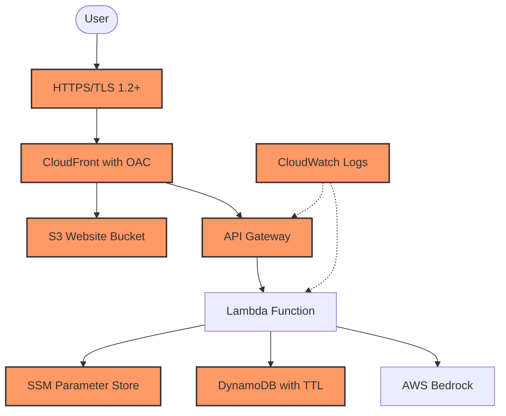

# CloudForgeX: Security Architecture and Controls

## Table of Contents

1. [Security Architecture Overview](#security-architecture-overview)
   - [Security Design Principles](#security-design-principles)
2. [Identity and Access Management](#identity-and-access-management)
   - [IAM Roles and Policies](#iam-roles-and-policies)
   - [Secrets Management](#secrets-management)
3. [Data Protection](#data-protection)
   - [Encryption in Transit](#encryption-in-transit)
   - [S3 Bucket Protection](#s3-bucket-protection)
   - [Data Lifecycle Management](#data-lifecycle-management)
   - [Token Waste Prevention](#token-waste-prevention)
4. [Network Security](#network-security)
   - [CloudFront Origin Access Control](#cloudfront-origin-access-control)
   - [CORS Configuration](#cors-configuration)
5. [Container Security](#container-security)
   - [Docker Security Controls](#docker-security-controls)
6. [Monitoring and Detection](#monitoring-and-detection)
   - [CloudWatch Logs](#cloudwatch-logs)
7. [Security Considerations and Future Enhancements](#security-considerations-and-future-enhancements)
8. [References](#references)

---

## Security Architecture Overview

CloudForgeX implements a defence-in-depth security strategy across all layers of the application stack, following [AWS Well-Architected Security Pillar principles](https://aws.amazon.com/architecture/security-identity-compliance/). The security architecture employs multiple overlapping controls to protect against various threat vectors whilst maintaining a seamless user experience.



This security architecture diagram illustrates the key components and security controls implemented in CloudForgeX. Each component is secured using AWS best practices and follows the principle of defence in depth.

### Security Design Principles

- **Defence in Depth**: Multiple security controls at each layer to provide redundant protection
- **Least Privilege**: Minimal permissions for all components to reduce attack surface
- **Secure by Default**: Security built into the architecture from inception rather than added later
- **Encryption in Transit**: Data encrypted during transmission to prevent interception
- **Immutable Infrastructure**: Infrastructure defined as code with version control for consistency and auditability

---

## Identity and Access Management

### IAM Roles and Policies

CloudForgeX implements the principle of least privilege through carefully scoped IAM roles and policies. Each service component has a dedicated IAM role with only the permissions required for its specific function. This approach was chosen to minimise the potential impact of credential compromise and to adhere to AWS security best practices.

#### Lambda Execution Role

```json
{
  "Version": "2012-10-17",
  "Statement": [
    {
      "Effect": "Allow",
      "Action": [
        "bedrock:InvokeModel",
        "bedrock:InvokeModelWithResponseStream"
      ],
      "Resource": "*"
    },
    {
      "Effect": "Allow",
      "Action": [
        "logs:CreateLogGroup",
        "logs:CreateLogStream",
        "logs:PutLogEvents"
      ],
      "Resource": "*"
    },
    {
      "Effect": "Allow",
      "Action": ["dynamodb:PutItem"],
      "Resource": "${dynamodb_table_arn}"
    },
    {
      "Effect": "Allow",
      "Action": ["ssm:GetParameter"],
      "Resource": "${ssm_parameter_arns}"
    }
  ]
}
```

#### S3 Bucket Policy

```json
{
  "Statement": [
    {
      "Effect": "Allow",
      "Principal": {
        "Service": "cloudfront.amazonaws.com"
      },
      "Action": "s3:GetObject",
      "Resource": "${s3_bucket_arn}/*",
      "Condition": {
        "StringEquals": {
          "AWS:SourceArn": "${cloudfront_distribution_arn}"
        }
      }
    }
  ]
}
```

### Secrets Management

Configuration values are stored in AWS Systems Manager Parameter Store:

```terraform
resource "aws_ssm_parameter" "cfx_allowed_origin" {
  name        = "/cloudforgex/${var.environment}/allowed_origin"
  description = "CORS allowed origin for CloudForgeX API Gateway"
  type        = "String"
  value       = var.allowed_origin
  tier        = var.parameter_tier

  tags = var.tags
}
```

Lambda functions retrieve these parameters at runtime using the AWS SDK:

```python
def get_ssm_parameter(parameter_name, default_value=None):
    """
    Get a parameter from SSM Parameter Store with caching

    Args:
        parameter_name: Full SSM parameter path
        default_value: Value to return if parameter cannot be retrieved

    Returns:
        Parameter value or default if not found
    """
    # Check cache first
    if parameter_name in _parameter_cache:
        return _parameter_cache[parameter_name]

    # Get region from environment variable
    region = os.environ.get('AWS_REGION', 'us-east-1')

    try:
        # Initialise SSM Client
        ssm_client = boto3.client('ssm', region_name=region)

        # Get parameter from SSM
        response = ssm_client.get_parameter(Name=parameter_name)
        value = response['Parameter']['Value']

        # Cache the parameter
        _parameter_cache[parameter_name] = value
        logger.info(f"Retrieved parameter {parameter_name} from SSM")

        return value
    except Exception as e:
        logger.warning(f"Failed to retrieve {parameter_name} from SSM: {str(e)}. Using default value.")
        return default_value
```

---

## Data Protection

### Encryption in Transit

All data in transit is encrypted using TLS 1.2 or higher:

```terraform
viewer_certificate {
  acm_certificate_arn      = var.acm_cert_arn
  ssl_support_method       = "sni-only"
  minimum_protocol_version = "TLSv1.2_2021"
}
```

CloudFront is configured to redirect HTTP to HTTPS:

```terraform
default_cache_behavior {
  viewer_protocol_policy = "redirect-to-https"
}
```

### S3 Bucket Protection

S3 buckets are protected with public access blocks to prevent accidental exposure of website content. This is a critical security control as S3 bucket misconfigurations are a common source of data breaches:

```terraform
resource "aws_s3_bucket_public_access_block" "web_access_block" {
  bucket = aws_s3_bucket.cfx_s3_bucket.id

  block_public_acls       = true
  block_public_policy     = true
  ignore_public_acls      = true
  restrict_public_buckets = true
}
```

### Data Lifecycle Management

DynamoDB tables implement TTL (Time-to-Live) for automatic data expiration:

```terraform
ttl {
  attribute_name = var.ttl_attribute
  enabled        = true
}
```

### Token Waste Prevention

The Lambda function implements input validation to prevent abuse and token waste. This security control serves dual purposes: it protects against potential denial-of-service attacks and reduces operational costs by preventing unnecessary API calls to AWS Bedrock:

```python
def contains_wasteful_patterns(message: str) -> bool:
    """Check if message contains patterns that waste tokens"""
    lowered = message.lower().strip()
    words = lowered.split()

    # Legitimate messages are usually longer than 3 words
    if len(words) > 3:
        return False

    # Block messages that are too short and contain junk words
    if any(word in BANNED_PATTERNS for word in words):
        logger.info(f"Blocked wasteful pattern: {len(words)} words")
        return True

    return False
```

---

## Network Security

### CloudFront Origin Access Control

CloudFront uses Origin Access Control (OAC) to secure S3 access:

```terraform
resource "aws_cloudfront_origin_access_control" "cfx_oac" {
  name                              = "S3-OAC"
  description                       = "OAC for S3 bucket"
  origin_access_control_origin_type = "s3"
  signing_behavior                  = "always"
  signing_protocol                  = "sigv4"
}
```

### CORS Configuration

API Gateway is configured with CORS headers to control cross-origin requests. This implementation prevents unauthorised websites from making requests to our API while allowing our frontend application to communicate securely.

```terraform
resource "aws_api_gateway_method_response" "cors_method_response" {
  rest_api_id = aws_api_gateway_rest_api.cfx_rest_api.id
  resource_id = aws_api_gateway_resource.cfx_api_gw.id
  http_method = aws_api_gateway_method.cfx_options_method.http_method
  status_code = "200"

  response_parameters = {
    "method.response.header.Access-Control-Allow-Headers" = true,
    "method.response.header.Access-Control-Allow-Methods" = true,
    "method.response.header.Access-Control-Allow-Origin"  = true
  }
}

resource "aws_api_gateway_integration_response" "cors_integration_response" {
  rest_api_id = aws_api_gateway_rest_api.cfx_rest_api.id
  resource_id = aws_api_gateway_resource.cfx_api_gw.id
  http_method = aws_api_gateway_method.cfx_options_method.http_method
  status_code = aws_api_gateway_method_response.cors_method_response.status_code

  response_parameters = {
    "method.response.header.Access-Control-Allow-Headers" = "'Content-Type,Authorization'",
    "method.response.header.Access-Control-Allow-Methods" = "'OPTIONS,POST'",
    "method.response.header.Access-Control-Allow-Origin"  = "'${var.allowed_origin}'"
  }
}
```

---

## Container Security

### Docker Security Controls

The containerised version of CloudForgeX implements security controls:

```dockerfile
# Non-root user for security
RUN addgroup --system --gid 1001 pygroup && \
    adduser --system --uid 1001 --gid 1001 pyuser && \
    chown -R pyuser:pygroup /app

USER pyuser

# Health check for monitoring
HEALTHCHECK --interval=30s --timeout=3s CMD curl -f http://localhost:8000/health || exit 1
```

---

## Monitoring and Detection

### CloudWatch Logs

Lambda functions are configured to log to CloudWatch for monitoring and troubleshooting. This provides an audit trail of system activity and enables security event detection. The logs are used to identify unusual patterns, errors, and potential security incidents:

```json
{
  "Effect": "Allow",
  "Action": [
    "logs:CreateLogGroup",
    "logs:CreateLogStream",
    "logs:PutLogEvents"
  ],
  "Resource": "*"
}
```

---

## Security Considerations and Future Enhancements

While the current implementation provides a solid security foundation, the following enhancements could be considered for future iterations:

1. **Encryption at Rest**: Implement server-side encryption for S3 and DynamoDB using AWS KMS
2. **Enhanced Monitoring**: Add CloudWatch Alarms for security-related events
3. **Web Application Firewall**: Integrate AWS WAF for additional API protection
4. **Security Headers**: Implement security headers via CloudFront response headers policy

## References

- [AWS Well-Architected Security Pillar](https://docs.aws.amazon.com/wellarchitected/latest/security-pillar/welcome.html) - Core security design principles used throughout CloudForgeX architecture.

- [AWS Security Best Practices](https://aws.amazon.com/architecture/security-identity-compliance/) - Security standards implemented for IAM policies, encryption, and network security controls.

- [OWASP API Security Top 10](https://owasp.org/www-project-api-security/) - API security best practices implemented in the CloudForgeX API Gateway and Lambda functions.

- [Docker Security Best Practices](https://docs.docker.com/develop/security-best-practices/) - Security controls implemented for container images in CloudForgeX.

- [S3 Security Best Practices](https://docs.aws.amazon.com/AmazonS3/latest/userguide/security-best-practices.html) - Security controls implemented for S3 buckets in CloudForgeX.

---
