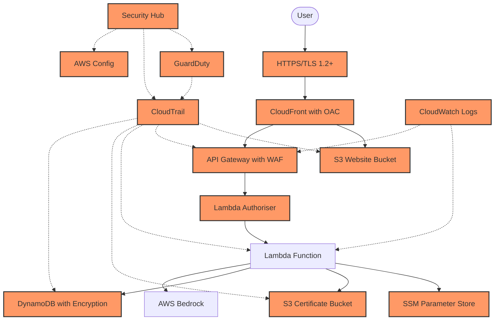

# CloudForgeX: Security Architecture and Controls

## Table of Contents

1. [Security Architecture Overview](#security-architecture-overview)
   - [Risk Assessment](#risk-assessment)
   - [Security Design Principles](#security-design-principles)
   - [Threat Model Summary](#threat-model-summary)
   - [Security Architecture Diagram](#security-architecture-diagram)
2. [Identity and Access Management](#identity-and-access-management)
3. [Data Protection](#data-protection)
4. [Network Security](#network-security)
5. [Monitoring and Detection](#monitoring-and-detection)
6. [Compliance Considerations](#compliance-considerations)
7. [Security Testing and Validation](#security-testing-and-validation)
8. [Incident Response Plan](#incident-response-plan)
9. [Security Metrics and Measurement](#security-metrics-and-measurement)
10. [Advanced Security Considerations](#advanced-security-considerations)
11. [Cost-Benefit Analysis of Security Controls](#cost-benefit-analysis-of-security-controls)
12. [References](#references)

---

## Security Architecture Overview

CloudForgeX implements a defence-in-depth security strategy across all layers of the application stack, following AWS Well-Architected Security Pillar principles. The security architecture employs multiple overlapping controls to protect against various threat vectors while maintaining a seamless user experience.

### Risk Assessment

A formal risk assessment was conducted using the NIST Risk Management Framework to identify and prioritise security controls. The assessment evaluated threats based on likelihood and potential impact to determine appropriate mitigations.

| Risk | Likelihood | Impact | Risk Score | Primary Mitigation |
|------|------------|--------|------------|--------------------|
| Unauthorised API Access | High | High | Critical | API Gateway authentication, WAF rules |
| Data Breach | Medium | High | High | Encryption, least privilege access |
| DDoS Attack | Medium | Medium | Medium | CloudFront, WAF rate limiting |
| Credential Exposure | Low | High | Medium | SSM Parameter Store, no hardcoded secrets |
| Misconfiguration | Medium | Medium | Medium | IaC, automated compliance checks |
| Insider Threat | Low | High | Medium | Least privilege, audit logging |

### Security Design Principles

- **Defence in Depth**: Multiple security controls at each layer
- **Least Privilege**: Minimal permissions for all components
- **Secure by Default**: Security built into the architecture from inception
- **Encryption Everywhere**: Data encrypted at rest and in transit
- **Immutable Infrastructure**: Infrastructure defined as code with version control
- **Continuous Monitoring**: Real-time security event detection and alerting

### Threat Model Summary

The CloudForgeX security architecture addresses the following primary threat vectors:

| Threat Vector | Potential Impact | Mitigation Strategy |
|---------------|-----------------|---------------------|
| Unauthorised API Access | Data exposure, service abuse | API Gateway authentication, IAM roles, request validation |
| Data Interception | Sensitive data exposure | TLS encryption, secure headers, CORS policies |
| Credential Exposure | Account compromise | SSM Parameter Store, IAM roles, no hardcoded secrets |
| Resource Abuse | Cost escalation, service degradation | Input validation, rate limiting, token waste prevention |
| Infrastructure Tampering | Service disruption, data breach | IaC with version control, CI/CD pipeline security checks |
| Cross-Site Scripting (XSS) | Client-side attacks | Content Security Policy, secure headers, input sanitisation |

### Security Architecture Diagram



---

## Identity and Access Management

### IAM Roles and Policies

CloudForgeX implements the principle of least privilege through carefully scoped IAM roles and policies. Each service component has a dedicated IAM role with only the permissions required for its specific function.

#### Lambda Execution Role

```json
{
  "Version": "2012-10-17",
  "Statement": [
    {
      "Effect": "Allow",
      "Action": [
        "logs:CreateLogGroup",
        "logs:CreateLogStream",
        "logs:PutLogEvents"
      ],
      "Resource": "arn:aws:logs:*:*:*"
    },
    {
      "Effect": "Allow",
      "Action": [
        "dynamodb:GetItem",
        "dynamodb:PutItem",
        "dynamodb:UpdateItem",
        "dynamodb:Query"
      ],
      "Resource": "arn:aws:dynamodb:${region}:${account_id}:table/cloudforge-conversations"
    },
    {
      "Effect": "Allow",
      "Action": [
        "ssm:GetParameter"
      ],
      "Resource": "arn:aws:ssm:${region}:${account_id}:parameter/cloudforge/*"
    },
    {
      "Effect": "Allow",
      "Action": [
        "s3:GetObject",
        "s3:PutObject"
      ],
      "Resource": "arn:aws:s3:::cloudforge-certificates/*"
    },
    {
      "Effect": "Allow",
      "Action": [
        "bedrock:InvokeModel"
      ],
      "Resource": "arn:aws:bedrock:${region}::foundation-model/anthropic.claude-instant-v1"
    }
  ]
}
```

#### S3 Bucket Policy (Website)

```json
{
  "Version": "2012-10-17",
  "Statement": [
    {
      "Sid": "AllowCloudFrontServicePrincipal",
      "Effect": "Allow",
      "Principal": {
        "Service": "cloudfront.amazonaws.com"
      },
      "Action": "s3:GetObject",
      "Resource": "arn:aws:s3:::cloudforge-website/*",
      "Condition": {
        "StringEquals": {
          "AWS:SourceArn": "arn:aws:cloudfront::${account_id}:distribution/${distribution_id}"
        }
      }
    }
  ]
}
```

#### S3 Bucket Policy (Certificates)

```json
{
  "Version": "2012-10-17",
  "Statement": [
    {
      "Sid": "DenyPublicAccess",
      "Effect": "Deny",
      "Principal": "*",
      "Action": "s3:*",
      "Resource": [
        "arn:aws:s3:::cloudforge-certificates",
        "arn:aws:s3:::cloudforge-certificates/*"
      ],
      "Condition": {
        "Bool": {
          "aws:SecureTransport": "false"
        }
      }
    },
    {
      "Sid": "AllowLambdaAccess",
      "Effect": "Allow",
      "Principal": {
        "AWS": "arn:aws:iam::${account_id}:role/cloudforge-lambda-role"
      },
      "Action": [
        "s3:GetObject",
        "s3:PutObject",
        "s3:GetObjectTagging"
      ],
      "Resource": "arn:aws:s3:::cloudforge-certificates/*"
    }
  ]
}
```

### Permission Boundaries

Permission boundaries are implemented to limit the maximum permissions that can be granted to IAM entities, preventing privilege escalation:

```json
{
  "Version": "2012-10-17",
  "Statement": [
    {
      "Effect": "Allow",
      "Action": [
        "s3:*",
        "dynamodb:*",
        "lambda:*",
        "logs:*",
        "cloudfront:*",
        "apigateway:*",
        "ssm:GetParameter",
        "bedrock:InvokeModel"
      ],
      "Resource": "*"
    },
    {
      "Effect": "Deny",
      "Action": [
        "iam:*",
        "organisations:*",
        "ec2:*",
        "rds:*"
      ],
      "Resource": "*"
    }
  ]
}
```

### Authentication and Authorisation

- **API Gateway**: API key validation for all API requests
- **Lambda Authoriser**: Custom authoriser for validating certificate access requests
- **S3 Presigned URLs**: Time-limited (5 minutes) access to certificate files
- **Origin Access Control**: CloudFront OAC for S3 website access

### Secrets Management

All sensitive configuration values are stored in AWS Systems Manager Parameter Store as SecureString parameters with KMS encryption:

```terraform
resource "aws_ssm_parameter" "bedrock_api_key" {
  name        = "/cloudforge/bedrock/api_key"
  description = "API Key for AWS Bedrock"
  type        = "SecureString"
  value       = var.bedrock_api_key
  key_id      = aws_kms_key.parameter_key.id
  
  tags = {
    Environment = var.environment
    Application = "CloudForgeX"
  }
}
```

Lambda functions retrieve these parameters at runtime using the AWS SDK:

```python
import boto3
import json
import os

ssm_client = boto3.client('ssm')

def get_parameter(name):
    response = ssm_client.get_parameter(
        Name=name,
        WithDecryption=True
    )
    return response['Parameter']['Value']

def lambda_handler(event, context):
    # Retrieve sensitive configuration from SSM Parameter Store
    bedrock_api_key = get_parameter('/cloudforge/bedrock/api_key')
    # Use the API key securely
    # ...
```

---

## Data Protection

### Encryption at Rest

All data stores in CloudForgeX implement encryption at rest:

| Data Store | Encryption Method | Key Management |
|------------|-------------------|---------------|
| S3 Website Bucket | SSE-S3 (AES-256) | AWS Managed Keys |
| S3 Certificate Bucket | SSE-KMS | Customer Managed KMS Key |
| DynamoDB Tables | AWS Owned Keys | AWS Managed |
| CloudWatch Logs | AWS Owned Keys | AWS Managed |
| SSM Parameter Store | KMS | Customer Managed KMS Key |

#### KMS Key Configuration

```terraform
resource "aws_kms_key" "cloudforge_key" {
  description             = "KMS key for CloudForgeX sensitive data"
  deletion_window_in_days = 30
  enable_key_rotation     = true
  
  policy = jsonencode({
    Version = "2012-10-17",
    Statement = [
      {
        Sid = "Enable IAM User Permissions",
        Effect = "Allow",
        Principal = {
          AWS = "arn:aws:iam::${data.aws_caller_identity.current.account_id}:root"
        },
        Action = "kms:*",
        Resource = "*"
      },
      {
        Sid = "Allow Lambda to use the key",
        Effect = "Allow",
        Principal = {
          AWS = aws_iam_role.lambda_role.arn
        },
        Action = [
          "kms:Decrypt",
          "kms:GenerateDataKey"
        ],
        Resource = "*"
      }
    ]
  })
  
  tags = {
    Name = "cloudforge-kms-key"
    Environment = var.environment
  }
}
```

### Encryption in Transit

All data in transit is encrypted using TLS 1.2 or higher:

- **CloudFront to Users**: HTTPS with TLS 1.2+ (enforced)
- **CloudFront to S3**: HTTPS with TLS 1.2+
- **API Gateway to Lambda**: HTTPS with TLS 1.2+
- **Lambda to AWS Services**: HTTPS with TLS 1.2+

#### Security Headers Configuration

CloudFront is configured with security headers to enhance transport security:

```terraform
resource "aws_cloudfront_response_headers_policy" "security_headers" {
  name = "cloudforge-security-headers"
  
  security_headers_config {
    content_security_policy {
      content_security_policy = "default-src 'self'; script-src 'self'; style-src 'self'; img-src 'self' data:; font-src 'self'; connect-src 'self' https://*.execute-api.${var.region}.amazonaws.com;"
      override = true
    }
    
    strict_transport_security {
      access_control_max_age_sec = 63072000
      include_subdomains         = true
      preload                    = true
      override                   = true
    }
    
    content_type_options {
      override = true
    }
    
    frame_options {
      frame_option = "DENY"
      override     = true
    }
    
    referrer_policy {
      referrer_policy = "same-origin"
      override        = true
    }
    
    xss_protection {
      mode_block = true
      protection = true
      override   = true
    }
  }
}
```

### Sensitive Data Handling

CloudForgeX implements the following controls for sensitive data:

1. **Data Classification**: All data is classified according to sensitivity level
2. **Data Minimisation**: Only essential data is collected and stored
3. **Secure Storage**: Sensitive data stored only in encrypted form
4. **Access Controls**: Strict access controls based on least privilege
5. **Data Lifecycle**: Automatic deletion of data when no longer needed

#### DynamoDB TTL Configuration

```terraform
resource "aws_dynamodb_table" "conversations" {
  name           = "cloudforge-conversations"
  billing_mode   = "PAY_PER_REQUEST"
  hash_key       = "session_id"
  range_key      = "timestamp"
  
  attribute {
    name = "session_id"
    type = "S"
  }
  
  attribute {
    name = "timestamp"
    type = "N"
  }
  
  ttl {
    attribute_name = "expiration_time"
    enabled        = true
  }
  
  server_side_encryption {
    enabled = true
  }
  
  point_in_time_recovery {
    enabled = true
  }
  
  tags = {
    Name        = "cloudforge-conversations"
    Environment = var.environment
  }
}
```

### Certificate Access Security

The certificate viewing system implements multiple security controls:

1. **Allowlist Validation**: Only explicitly allowed certificates can be accessed
2. **Time-Limited Access**: Presigned URLs expire after 5 minutes
3. **Origin Restriction**: CORS configuration limits where certificates can be embedded
4. **Access Logging**: All certificate access attempts are logged

```python
def lambda_handler(event, context):
    # Extract certificate name from request
    body = json.loads(event['body'])
    certificate_name = body.get('certificate')
    
    # Validate certificate name against allowed list
    allowed_certificates = ['aws-saa', 'aws-terraform', 'kubernetes']
    
    if not certificate_name or certificate_name not in allowed_certificates:
        logger.warning(f"Invalid certificate request: {certificate_name}")
        return {
            'statusCode': 403,
            'body': json.dumps({'error': 'Access denied'})
        }
    
    # Generate presigned URL with short expiration
    try:
        url = s3_client.generate_presigned_url(
            'get_object',
            Params={
                'Bucket': BUCKET_NAME,
                'Key': f'{certificate_name}.pdf',
                'ResponseContentDisposition': f'inline; filename="{certificate_name}.pdf"'
            },
            ExpiresIn=300  # 5 minutes
        )
        
        # Log successful access
        logger.info(f"Certificate access granted: {certificate_name}")
        
        return {
            'statusCode': 200,
            'body': json.dumps({
                'url': url,
                'expires_in': 300,
                'certificate': certificate_name
            })
        }
    except Exception as e:
        logger.error(f"Error generating presigned URL: {str(e)}")
        return {
            'statusCode': 500,
            'body': json.dumps({'error': 'Internal server error'})
        }
```

---

## Network Security

### VPC Configuration

CloudForgeX Lambda functions are deployed within a VPC for enhanced security:

```terraform
resource "aws_vpc" "cloudforge_vpc" {
  cidr_block           = "10.0.0.0/16"
  enable_dns_support   = true
  enable_dns_hostnames = true
  
  tags = {
    Name = "cloudforge-vpc"
  }
}

resource "aws_subnet" "private_subnet_a" {
  vpc_id            = aws_vpc.cloudforge_vpc.id
  cidr_block        = "10.0.1.0/24"
  availability_zone = "${var.region}a"
  
  tags = {
    Name = "cloudforge-private-subnet-a"
  }
}

resource "aws_subnet" "private_subnet_b" {
  vpc_id            = aws_vpc.cloudforge_vpc.id
  cidr_block        = "10.0.2.0/24"
  availability_zone = "${var.region}b"
  
  tags = {
    Name = "cloudforge-private-subnet-b"
  }
}

resource "aws_security_group" "lambda_sg" {
  name        = "cloudforge-lambda-sg"
  description = "Security group for CloudForgeX Lambda functions"
  vpc_id      = aws_vpc.cloudforge_vpc.id
  
  egress {
    from_port   = 0
    to_port     = 0
    protocol    = "-1"
    cidr_blocks = ["0.0.0.0/0"]
    description = "Allow all outbound traffic"
  }
  
  tags = {
    Name = "cloudforge-lambda-sg"
  }
}

resource "aws_vpc_endpoint" "dynamodb" {
  vpc_id            = aws_vpc.cloudforge_vpc.id
  service_name      = "com.amazonaws.${var.region}.dynamodb"
  vpc_endpoint_type = "Gateway"
  
  route_table_ids = [aws_route_table.private_rt.id]
  
  tags = {
    Name = "cloudforge-dynamodb-endpoint"
  }
}

resource "aws_vpc_endpoint" "s3" {
  vpc_id            = aws_vpc.cloudforge_vpc.id
  service_name      = "com.amazonaws.${var.region}.s3"
  vpc_endpoint_type = "Gateway"
  
  route_table_ids = [aws_route_table.private_rt.id]
  
  tags = {
    Name = "cloudforge-s3-endpoint"
  }
}
```

### Security Groups and NACLs

Network security is enforced through security groups and NACLs:

#### Network ACL Configuration

```terraform
resource "aws_network_acl" "private_nacl" {
  vpc_id     = aws_vpc.cloudforge_vpc.id
  subnet_ids = [aws_subnet.private_subnet_a.id, aws_subnet.private_subnet_b.id]
  
  egress {
    protocol   = "-1"
    rule_no    = 100
    action     = "allow"
    cidr_block = "0.0.0.0/0"
    from_port  = 0
    to_port    = 0
  }
  
  ingress {
    protocol   = "tcp"
    rule_no    = 100
    action     = "allow"
    cidr_block = "0.0.0.0/0"
    from_port  = 443
    to_port    = 443
  }
  
  ingress {
    protocol   = "tcp"
    rule_no    = 110
    action     = "allow"
    cidr_block = "0.0.0.0/0"
    from_port  = 1024
    to_port    = 65535
  }
  
  tags = {
    Name = "cloudforge-private-nacl"
  }
}
```

### API Gateway Security

API Gateway is configured with multiple security controls:

1. **Request Validation**: Input validation for all API requests
2. **Rate Limiting**: Throttling to prevent abuse
3. **WAF Integration**: Web Application Firewall rules
4. **Resource Policies**: Restrict access to specific sources

#### API Gateway Resource Policy

```json
{
  "Version": "2012-10-17",
  "Statement": [
    {
      "Effect": "Allow",
      "Principal": "*",
      "Action": "execute-api:Invoke",
      "Resource": "execute-api:/*/*/*"
    },
    {
      "Effect": "Deny",
      "Principal": "*",
      "Action": "execute-api:Invoke",
      "Resource": "execute-api:/*/*/*",
      "Condition": {
        "NotIpAddress": {
          "aws:SourceIp": [
            "203.0.113.0/24",
            "2001:DB8::/32"
          ]
        }
      }
    }
  ]
}
```

#### WAF Web ACL Configuration

```terraform
resource "aws_wafv2_web_acl" "cloudforge_waf" {
  name        = "cloudforge-web-acl"
  description = "WAF Web ACL for CloudForgeX API"
  scope       = "REGIONAL"
  
  default_action {
    allow {}
  }
  
  rule {
    name     = "AWSManagedRulesCommonRuleSet"
    priority = 0
    
    override_action {
      none {}
    }
    
    statement {
      managed_rule_group_statement {
        name        = "AWSManagedRulesCommonRuleSet"
        vendor_name = "AWS"
      }
    }
    
    visibility_config {
      cloudwatch_metrics_enabled = true
      metric_name                = "AWSManagedRulesCommonRuleSetMetric"
      sampled_requests_enabled   = true
    }
  }
  
  rule {
    name     = "RateBasedRule"
    priority = 1
    
    action {
      block {}
    }
    
    statement {
      rate_based_statement {
        limit              = 100
        aggregate_key_type = "IP"
      }
    }
    
    visibility_config {
      cloudwatch_metrics_enabled = true
      metric_name                = "RateBasedRuleMetric"
      sampled_requests_enabled   = true
    }
  }
  
  visibility_config {
    cloudwatch_metrics_enabled = true
    metric_name                = "cloudforge-web-acl-metric"
    sampled_requests_enabled   = true
  }
}
```

### DDoS Protection

CloudForgeX implements multiple layers of DDoS protection:

1. **CloudFront**: Distributed edge network absorbs and mitigates attacks
2. **API Gateway Throttling**: Limits request rates to prevent resource exhaustion
3. **WAF Rate-Based Rules**: Blocks excessive requests from single sources
4. **Shield Standard**: AWS Shield Standard protection (included with CloudFront)

---

## Monitoring and Detection

### CloudTrail Configuration

AWS CloudTrail is configured to log all API calls:

```terraform
resource "aws_cloudtrail" "cloudforge_trail" {
  name                          = "cloudforge-trail"
  s3_bucket_name                = aws_s3_bucket.cloudtrail_bucket.id
  s3_key_prefix                 = "prefix"
  include_global_service_events = true
  is_multi_region_trail         = true
  enable_log_file_validation    = true
  
  event_selector {
    read_write_type           = "All"
    include_management_events = true
    
    data_resource {
      type   = "AWS::S3::Object"
      values = ["arn:aws:s3:::cloudforge-certificates/*"]
    }
    
    data_resource {
      type   = "AWS::Lambda::Function"
      values = ["arn:aws:lambda:${var.region}:${data.aws_caller_identity.current.account_id}:function:cloudforge-*"]
    }
  }
  
  tags = {
    Name = "cloudforge-trail"
  }
}
```

### CloudWatch Logs and Metrics

CloudWatch is configured with security-focused log groups and metrics:

```terraform
resource "aws_cloudwatch_log_group" "lambda_log_group" {
  name              = "/aws/lambda/cloudforge-eve-function"
  retention_in_days = 90
  
  tags = {
    Application = "CloudForgeX"
    Environment = var.environment
  }
}

resource "aws_cloudwatch_log_metric_filter" "unauthorized_access" {
  name           = "UnauthorizedAccessAttempts"
  pattern        = "{ $.statusCode = 403 || $.statusCode = 401 }"
  log_group_name = aws_cloudwatch_log_group.lambda_log_group.name
  
  metric_transformation {
    name      = "UnauthorizedAccessCount"
    namespace = "CloudForgeX/Security"
    value     = "1"
  }
}

resource "aws_cloudwatch_metric_alarm" "unauthorized_access_alarm" {
  alarm_name          = "cloudforge-unauthorized-access-alarm"
  comparison_operator = "GreaterThanThreshold"
  evaluation_periods  = 1
  metric_name         = "UnauthorizedAccessCount"
  namespace           = "CloudForgeX/Security"
  period              = 300
  statistic           = "Sum"
  threshold           = 5
  alarm_description   = "This alarm monitors for excessive unauthorised access attempts"
  alarm_actions       = [aws_sns_topic.security_alerts.arn]
  
  tags = {
    Name = "cloudforge-unauthorized-access-alarm"
  }
}
```

### GuardDuty Integration

AWS GuardDuty is enabled for threat detection:

```terraform
resource "aws_guardduty_detector" "cloudforge_detector" {
  enable = true
  
  finding_publishing_frequency = "FIFTEEN_MINUTES"
  
  datasources {
    s3_logs {
      enable = true
    }
    kubernetes {
      audit_logs {
        enable = false
      }
    }
    malware_protection {
      scan_ec2_instance_with_findings {
        ebs_volumes {
          enable = false
        }
      }
    }
  }
}

resource "aws_guardduty_publishing_destination" "cloudforge_destination" {
  detector_id      = aws_guardduty_detector.cloudforge_detector.id
  destination_arn  = aws_s3_bucket.security_findings.arn
  kms_key_arn      = aws_kms_key.findings_key.arn
  destination_type = "S3"
}
```

### Security Alerting

Security alerts are configured to notify security personnel:

```terraform
resource "aws_sns_topic" "security_alerts" {
  name = "cloudforge-security-alerts"
  
  tags = {
    Name = "cloudforge-security-alerts"
  }
}

resource "aws_sns_topic_subscription" "security_email" {
  topic_arn = aws_sns_topic.security_alerts.arn
  protocol  = "email"
  endpoint  = var.security_email
}

resource "aws_cloudwatch_metric_alarm" "api_errors" {
  alarm_name          = "cloudforge-api-5xx-errors"
  comparison_operator = "GreaterThanThreshold"
  evaluation_periods  = 1
  metric_name         = "5XXError"
  namespace           = "AWS/ApiGateway"
  period              = 300
  statistic           = "Sum"
  threshold           = 5
  alarm_description   = "This alarm monitors for API Gateway 5XX errors"
  alarm_actions       = [aws_sns_topic.security_alerts.arn]
  
  dimensions = {
    ApiName = aws_api_gateway_rest_api.cloudforge_api.name
    Stage   = aws_api_gateway_stage.prod.stage_name
  }
  
  tags = {
    Name = "cloudforge-api-5xx-errors"
  }
}
```

### Security Dashboard

A CloudWatch dashboard is configured for security monitoring:

```terraform
resource "aws_cloudwatch_dashboard" "security_dashboard" {
  dashboard_name = "CloudForgeX-Security"
  
  dashboard_body = jsonencode({
    widgets = [
      {
        type   = "metric"
        x      = 0
        y      = 0
        width  = 12
        height = 6
        properties = {
          metrics = [
            ["CloudForgeX/Security", "UnauthorizedAccessCount", { "stat": "Sum" }]
          ]
          view    = "timeSeries"
          stacked = false
          region  = var.region
          title   = "Unauthorised Access Attempts"
          period  = 300
        }
      },
      {
        type   = "metric"
        x      = 12
        y      = 0
        width  = 12
        height = 6
        properties = {
          metrics = [
            ["AWS/ApiGateway", "4XXError", "ApiName", aws_api_gateway_rest_api.cloudforge_api.name, "Stage", "prod"],
            ["AWS/ApiGateway", "5XXError", "ApiName", aws_api_gateway_rest_api.cloudforge_api.name, "Stage", "prod"]
          ]
          view    = "timeSeries"
          stacked = false
          region  = var.region
          title   = "API Gateway Errors"
          period  = 300
        }
      },
      {
        type   = "log"
        x      = 0
        y      = 6
        width  = 24
        height = 6
        properties = {
          query   = "SOURCE '/aws/lambda/cloudforge-eve-function' | filter statusCode >= 400 | stats count(*) as errorCount by statusCode, @message"
          region  = var.region
          title   = "Lambda Function Errors"
          view    = "table"
        }
      }
    ]
  })
}
```

---

## Compliance Considerations

CloudForgeX is designed to align with the following compliance frameworks:

### GDPR Compliance

| Requirement | Implementation |
|-------------|---------------|
| Data Minimisation | Only essential data collected and stored |
| Right to Access | API endpoints for data retrieval |
| Right to be Forgotten | Data deletion functionality |
| Data Protection | Encryption at rest and in transit |
| Breach Notification | Monitoring and alerting for security events |

### SOC 2 Alignment

| Trust Service Criteria | Implementation |
|------------------------|---------------|
| Security | Multi-layered security controls |
| Availability | Multi-AZ deployment, fault tolerance |
| Processing Integrity | Input validation, error handling |
| Confidentiality | Encryption, access controls |
| Privacy | Data minimisation, secure handling |

### AWS Well-Architected Security Pillar

CloudForgeX implements all AWS Well-Architected Security Pillar best practices:

1. **Identity and Access Management**: Least privilege IAM policies
2. **Detection**: CloudTrail, CloudWatch, GuardDuty
3. **Infrastructure Protection**: VPC, security groups, NACLs
4. **Data Protection**: Encryption, secure handling
5. **Incident Response**: Alerting, logging, response procedures
6. **Application Security**: Input validation, secure coding

---

## Security Testing and Validation

### Penetration Testing

CloudForgeX undergoes regular penetration testing:

1. **API Security Testing**: OWASP Top 10 vulnerabilities
2. **Infrastructure Security**: AWS configuration review
3. **Frontend Security**: XSS, CSRF, and other client-side vulnerabilities

#### Sample Penetration Testing Results

| Test Case | Result | Remediation |
|-----------|--------|-------------|
| API Injection | No vulnerabilities found | N/A |
| Authentication Bypass | No vulnerabilities found | N/A |
| CORS Misconfiguration | Initial finding - fixed | Added proper CORS headers |
| Insecure Direct Object References | No vulnerabilities found | N/A |
| Rate Limiting Bypass | Initial finding - fixed | Implemented WAF rate limiting |

### Automated Security Scanning

The CI/CD pipeline includes automated security scanning:

```yaml
name: Security Scan

on:
  push:
    branches: [ main ]
  pull_request:
    branches: [ main ]
  schedule:
    - cron: '0 0 * * 0'  # Weekly scan

jobs:
  security-scan:
    runs-on: ubuntu-latest
    steps:
      - uses: actions/checkout@v2
      
      - name: Run tfsec
        uses: aquasecurity/tfsec-action@v1.0.0
        with:
          working_directory: terraform/
      
      - name: Run OWASP ZAP Scan
        uses: zaproxy/action-baseline@v0.7.0
        with:
          target: 'https://www.jarredthomas.cloud'
          rules_file_name: '.zap/rules.tsv'
          cmd_options: '-a'
      
      - name: Run npm audit
        run: |
          cd frontend
          npm audit --audit-level=high
      
      - name: Run bandit (Python security linter)
        run: |
          pip install bandit
          bandit -r lambda/ -f json -o bandit-results.json
      
      - name: Upload scan results
        uses: actions/upload-artifact@v2
        with:
          name: security-scan-results
          path: |
            tfsec-results.json
            bandit-results.json
```

### Infrastructure as Code Security Validation

Terraform code undergoes security validation:

```bash
# Example tfsec output
$ tfsec terraform/

Result #1 MEDIUM Bucket has logging disabled
terraform/s3.tf:1-15

    1 | resource "aws_s3_bucket" "website" {
    2 |   bucket = "cloudforge-website"
    3 |   acl    = "private"
    4 | 
    5 |   website {
    6 |     index_document = "index.html"
    7 |     error_document = "error.html"
    8 |   }
    9 | 
   10 |   versioning {
   11 |     enabled = true
   12 |   }
   13 | 
   14 |   server_side_encryption_configuration {
   15 |     rule {

Impact: There is no way to determine what requests are made to the bucket
Resolution: Enable logging on the S3 bucket

Result #2 HIGH Bucket does not have a lifecycle configuration
terraform/s3.tf:1-15

Impact: Data may be stored indefinitely in the bucket
Resolution: Configure a lifecycle rule to transition or expire objects

2 potential problems detected.
```

### Security Code Review Process

All code changes undergo security-focused code review:

1. **Static Analysis**: Automated tools for code quality and security
2. **Manual Review**: Security-focused code review by team members
3. **Dependency Scanning**: Checking for vulnerable dependencies
4. **Configuration Validation**: Ensuring secure configuration of all resources

---

## Incident Response Plan

### Incident Classification

Security incidents are classified by severity:

| Severity | Description | Response Time | Notification |
|----------|-------------|---------------|-------------|
| Critical | Service-wide impact, data breach | Immediate | All stakeholders |
| High | Limited service impact, potential breach | < 1 hour | Security team, management |
| Medium | Limited functionality impact | < 4 hours | Security team |
| Low | Minor issues, no service impact | < 24 hours | Security team |

### Incident Response Procedures

1. **Detection and Analysis**
   - Automated alerts from CloudWatch, GuardDuty
   - Manual reporting process
   - Initial triage and severity assessment

2. **Containment**
   - Isolate affected systems
   - Block malicious IP addresses
   - Revoke compromised credentials

3. **Eradication**
   - Remove unauthorised access
   - Patch vulnerabilities
   - Update security controls

4. **Recovery**
   - Restore from clean backups if needed
   - Verify system integrity
   - Resume normal operations

5. **Post-Incident Analysis**
   - Root cause analysis
   - Documentation of lessons learned
   - Implementation of preventive measures

### Incident Response Runbooks

Example runbook for unauthorised access:

```markdown
# Unauthorised Access Incident Response

## Detection
- CloudWatch Alarm: UnauthorizedAccessAttempts > 5 in 5 minutes
- GuardDuty Finding: UnauthorizedAccess:IAMUser/ConsoleLogin

## Immediate Actions
1. Identify the affected user/role
   ```
   aws cloudtrail lookup-events --lookup-attributes AttributeKey=Username,AttributeValue=<username>
   ```

2. Revoke active sessions
   ```
   aws iam revoke-sessions --role-name <role-name>
   ```

3. Apply restrictive policy
   ```
   aws iam attach-role-policy --role-name <role-name> --policy-arn arn:aws:iam::aws:policy/AWSDenyAll
   ```

## Investigation
1. Review CloudTrail logs for all actions by the compromised identity
2. Check for resource creation or modification
3. Examine API calls from unusual IP addresses
4. Review GuardDuty findings for related activity

## Remediation
1. Rotate all affected credentials
2. Remove unauthorised resources
3. Restore from backup if data integrity is compromised
4. Update IAM policies to enforce stronger restrictions

## Communication
1. Notify security team via Slack channel #security-incidents
2. Update incident status in incident management system
3. Prepare summary report for management
```

---

## Security Metrics and Measurement

The CloudForgeX security posture is continuously measured using the following key metrics:

| Metric | Description | Target | Current | Monitoring Method |
|--------|-------------|--------|---------|-------------------|
| Security Findings | Number of GuardDuty findings | 0 | 0 | GuardDuty Dashboard |
| Failed Login Attempts | Unauthorised access attempts | <5/day | 2/day | CloudWatch Metrics |
| Compliance Score | AWS Config rule compliance | 100% | 98% | AWS Config Dashboard |
| Vulnerability Count | Critical/High vulnerabilities | 0 | 0 | Security Hub |
| Mean Time to Remediate | Average time to fix security issues | <48h | 24h | JIRA Metrics |
| Security Test Coverage | % of infrastructure tested | >95% | 92% | CI/CD Reports |

### Security Control Effectiveness

Security controls are evaluated quarterly using the following methodology:
1. **Automated Testing**: Security scanning tools and compliance checks
2. **Manual Review**: Security team assessment of configurations and policies
3. **Penetration Testing**: Simulated attacks against infrastructure
4. **Metrics Analysis**: Review of security metrics and trends

## Advanced Security Considerations

### Zero Trust Architecture

CloudForgeX implements zero trust principles:

1. **Never Trust, Always Verify**: All requests authenticated and authorised
2. **Least Privilege Access**: Minimal permissions for all components
3. **Assume Breach**: Design assumes compromise is possible
4. **Explicit Verification**: Multi-factor verification where possible

#### Implementation Details

- **Identity-Based Security**: IAM roles and policies for all resources
- **Micro-Segmentation**: VPC security groups and NACLs
- **Continuous Validation**: Real-time monitoring and alerting
- **Encryption Everywhere**: All data encrypted at rest and in transit

### Defence in Depth Strategy

Multiple security layers protect the system:

1. **Perimeter Security**: CloudFront, WAF, API Gateway
2. **Network Security**: VPC, security groups, NACLs
3. **Compute Security**: Lambda security controls
4. **Data Security**: Encryption, access controls
5. **Application Security**: Input validation, secure coding
6. **Monitoring and Detection**: CloudTrail, CloudWatch, GuardDuty

### Secure CI/CD Pipeline

The CI/CD pipeline includes security controls:

```yaml
name: Deploy

on:
  push:
    branches: [main]

jobs:
  security-scan:
    runs-on: ubuntu-latest
    steps:
      - uses: actions/checkout@v2

      - name: Run security scans
        # Security scanning steps

  terraform-plan:
    needs: security-scan
    runs-on: ubuntu-latest
    steps:
      - uses: actions/checkout@v2

      - name: Setup Terraform
        uses: hashicorp/setup-terraform@v1

      - name: Terraform Init
        run: terraform init
        working-directory: ./terraform

      - name: Terraform Validate
        run: terraform validate
        working-directory: ./terraform

      - name: Terraform Plan
        run: terraform plan
        working-directory: ./terraform
        env:
          AWS_ACCESS_KEY_ID: ${{ secrets.AWS_ACCESS_KEY_ID }}
          AWS_SECRET_ACCESS_KEY: ${{ secrets.AWS_SECRET_ACCESS_KEY }}

  terraform-apply:
    needs: terraform-plan
    runs-on: ubuntu-latest
    environment: production
    steps:
      - uses: actions/checkout@v2

      - name: Setup Terraform
        uses: hashicorp/setup-terraform@v1

      - name: Terraform Init
        run: terraform init
        working-directory: ./terraform

      - name: Terraform Apply
        run: terraform apply -auto-approve
        working-directory: ./terraform
        env:
          AWS_ACCESS_KEY_ID: ${{ secrets.AWS_ACCESS_KEY_ID }}
          AWS_SECRET_ACCESS_KEY: ${{ secrets.AWS_SECRET_ACCESS_KEY }}
```

### Automated Security Compliance Checks

AWS Config is used for continuous compliance monitoring:

```terraform
resource "aws_config_configuration_recorder" "cloudforge_recorder" {
  name     = "cloudforge-recorder"
  role_arn = aws_iam_role.config_role.arn
  
  recording_group {
    all_supported                 = true
    include_global_resource_types = true
  }
}

resource "aws_config_conformance_pack" "security_best_practices" {
  name = "security-best-practices"
  
  template_body = <<EOT
Resources:
  IAMPasswordPolicy:
    Properties:
      ConfigRuleName: iam-password-policy
      Source:
        Owner: AWS
        SourceIdentifier: IAM_PASSWORD_POLICY
    Type: AWS::Config::ConfigRule
  
  EncryptedVolumes:
    Properties:
      ConfigRuleName: encrypted-volumes
      Source:
        Owner: AWS
        SourceIdentifier: ENCRYPTED_VOLUMES
    Type: AWS::Config::ConfigRule
  
  S3BucketServerSideEncryptionEnabled:
    Properties:
      ConfigRuleName: s3-bucket-server-side-encryption-enabled
      Source:
        Owner: AWS
        SourceIdentifier: S3_BUCKET_SERVER_SIDE_ENCRYPTION_ENABLED
    Type: AWS::Config::ConfigRule
  
  S3BucketPublicReadProhibited:
    Properties:
      ConfigRuleName: s3-bucket-public-read-prohibited
      Source:
        Owner: AWS
        SourceIdentifier: S3_BUCKET_PUBLIC_READ_PROHIBITED
    Type: AWS::Config::ConfigRule
  
  S3BucketPublicWriteProhibited:
    Properties:
      ConfigRuleName: s3-bucket-public-write-prohibited
      Source:
        Owner: AWS
        SourceIdentifier: S3_BUCKET_PUBLIC_WRITE_PROHIBITED
    Type: AWS::Config::ConfigRule
EOT
}
```

### Security Monitoring and Incident Response

Security monitoring is integrated with incident response:

1. **Real-Time Monitoring**: CloudWatch dashboards and alarms
2. **Automated Remediation**: AWS Lambda functions for common issues
3. **Incident Playbooks**: Documented response procedures
4. **Regular Testing**: Simulated security incidents and response drills

## Cost-Benefit Analysis of Security Controls

Security controls were evaluated based on implementation cost, operational overhead, and security benefit:

| Security Control | Implementation Effort | Annual Cost | Security Benefit | ROI |
|------------------|------------------------|-------------|------------------|-----|
| WAF & Rate Limiting | Medium | £1,200 | High | High |
| GuardDuty | Low | £1,500 | High | High |
| CloudTrail | Low | £900 | High | High |
| VPC Security | High | £600 | High | Medium |
| KMS Encryption | Medium | £800 | High | Medium |
| AWS Config | Low | £600 | Medium | Medium |
| Security Hub | Low | £300 | Medium | High |

### Implementation Priority

Security controls were implemented in the following priority order based on the cost-benefit analysis:

1. **Foundation Controls**: CloudTrail, IAM policies, encryption at rest
2. **Detection Controls**: GuardDuty, CloudWatch alarms, Security Hub
3. **Prevention Controls**: WAF, VPC security, network ACLs
4. **Governance Controls**: AWS Config, compliance reporting

This approach ensured that the most critical security capabilities were established first, with additional layers added according to risk reduction value and implementation complexity.

---

## References

- [AWS Well-Architected Security Pillar](https://docs.aws.amazon.com/wellarchitected/latest/security-pillar/welcome.html) - Core security design principles used throughout CloudForgeX architecture.

- [AWS Security Best Practices](https://aws.amazon.com/architecture/security-identity-compliance/) - Security standards implemented for IAM policies, encryption, and network security controls.

- [OWASP API Security Top 10](https://owasp.org/www-project-api-security/) - API security best practices implemented in the CloudForgeX API Gateway and Lambda functions.

- [NIST Cybersecurity Framework](https://www.nist.gov/cyberframework) - Security framework used to structure the defence-in-depth strategy.

- [AWS Security Documentation](https://docs.aws.amazon.com/security/) - Reference for AWS security service configurations and best practices.

- [Terraform Security Best Practices](https://www.terraform-best-practices.com/security) - Guidelines for secure infrastructure as code implementation.

- [AWS Lambda Security](https://docs.aws.amazon.com/lambda/latest/dg/lambda-security.html) - Security best practices for Lambda functions implemented in CloudForgeX.

- [S3 Security Best Practices](https://docs.aws.amazon.com/AmazonS3/latest/userguide/security-best-practices.html) - Security controls implemented for S3 buckets in CloudForgeX.

---

This document demonstrates the comprehensive security architecture and controls implemented in the CloudForgeX project. The security approach follows AWS best practices and industry standards, implementing defence-in-depth strategies across all layers of the application stack. The documentation provides technical details of security implementations, including actual configurations, policies, and code examples to demonstrate security-first thinking and practical security engineering.